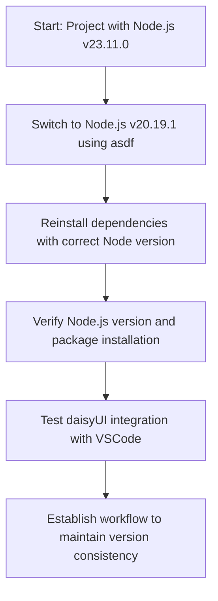

# Action Plan: Resolving Node.js Version Compatibility with daisyUI Setup

## Overview of the Issue

You're experiencing Node.js version compatibility issues while using daisyUI and Tailwind CSS:

- Your project requires Node.js v20.19.1
- You're currently running Node.js v23.11.0 with npm 10.9.2
- Despite version mismatch warnings, the packages were installed successfully

## Recommended Solution Path

Follow this sequence of steps to resolve the issues:

## Step-by-Step Implementation

### 1. Resolve Node.js Version Compatibility (15-20 minutes)

Follow the detailed steps in `nodejs-version-resolution.md`:

- Switch to Node.js v20.19.1 using asdf
- Clear npm cache
- Reinstall packages
- Verify correct installation

### 2. Verify VSCode daisyUI Integration (10-15 minutes)

Follow the verification steps in `daisyui-setup-verification.md`:

- Test VSCode configuration
- Try GitHub Copilot with daisyUI
- Test Context7 MCP server integration

### 3. Maintain Version Consistency (Ongoing)

- Always work from the project directory
- Verify the active Node.js version before beginning work
- Consider using direnv for automatic version switching
- Use the npm script version check before starting the application

## Expected Outcomes

After completing these steps, you should have:

1. ✅ A working development environment with the correct Node.js version (v20.19.1)
2. ✅ Proper installation of tailwindcss and daisyUI without compatibility warnings
3. ✅ Functioning VSCode integration with daisyUI including:
   - GitHub Copilot code generation with daisyUI knowledge
   - Context7 MCP server for enhanced AI assistance
4. ✅ A sustainable workflow to maintain version consistency

## Documentation Resources

1. `nodejs-version-resolution.md` - Detailed guide for resolving Node.js version issues
2. `daisyui-setup-verification.md` - Testing and verification of VSCode daisyUI integration
3. [asdf Documentation](https://asdf-vm.com/guide/getting-started.html) - For additional asdf commands and configurations
4. [daisyUI Documentation](https://daisyui.com/docs/) - For daisyUI reference
5. [Tailwind CSS Documentation](https://tailwindcss.com/docs) - For Tailwind CSS reference

## Next Steps

Once you've resolved the version compatibility issues, you'll be ready to continue development with a properly configured environment that supports daisyUI in VSCode.
